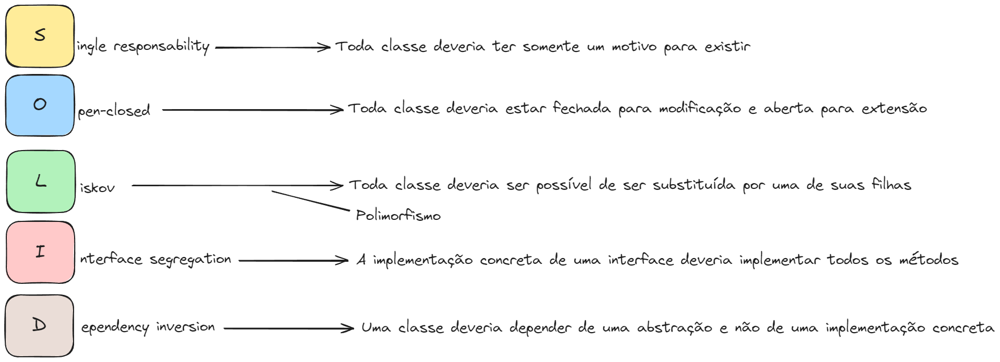
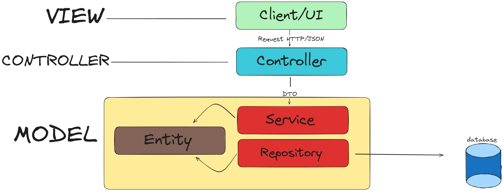

# API Typescript

## Api construída seguindo princípios de Solid com padrão de projeto MVC

### Princípios SOLID

### Arquitetura do projeto

### Tecnologias utilizadas
 - TYPESCRIPT

Referência:
<a href="https://www.youtube.com/watch?v=RY0BQV803UU">Vídeo</a>
